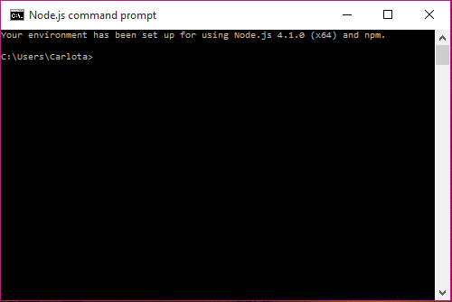
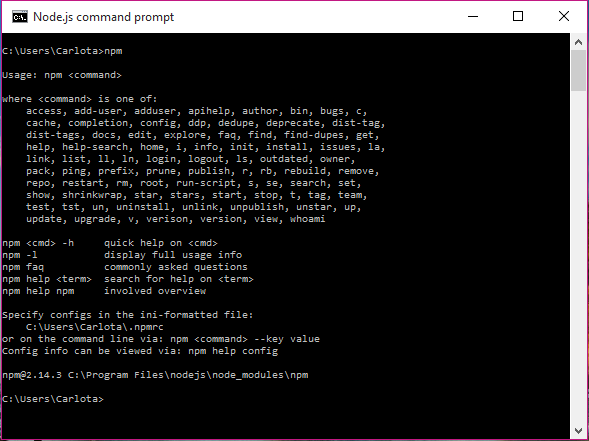
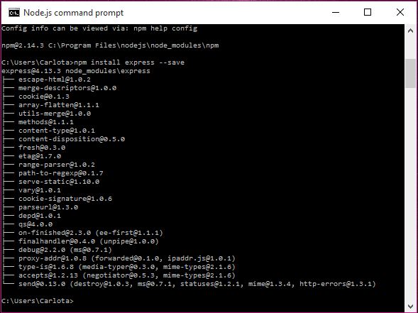
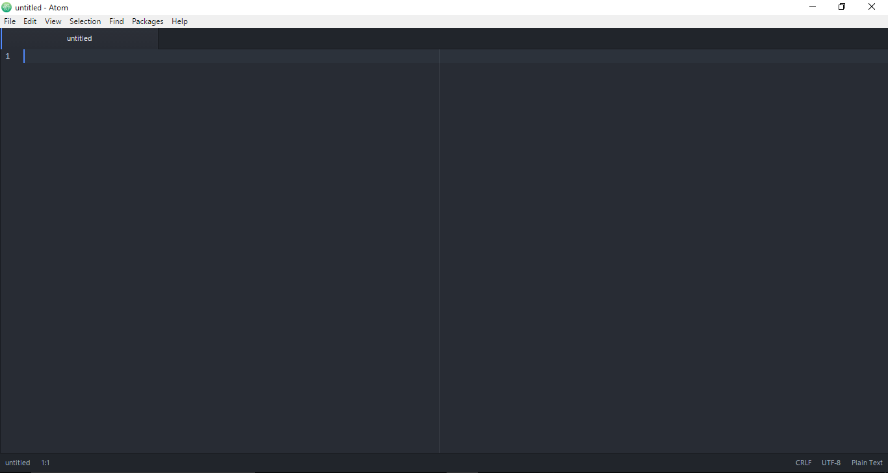
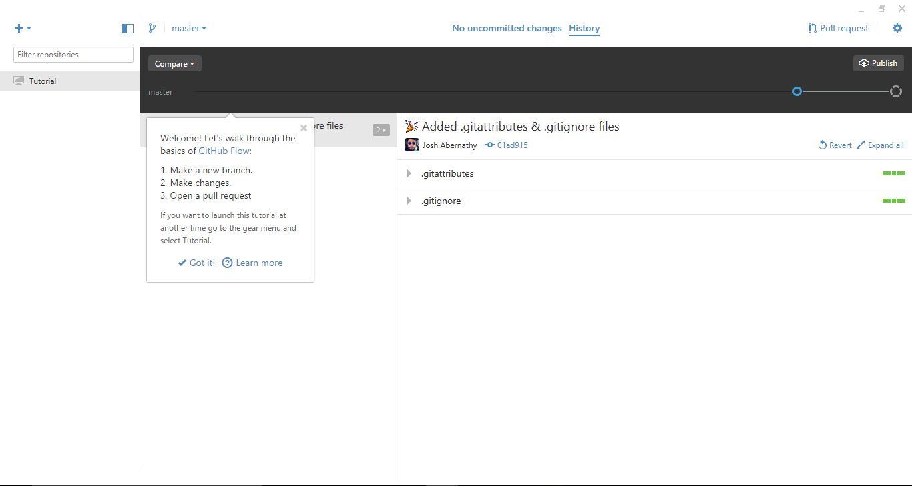
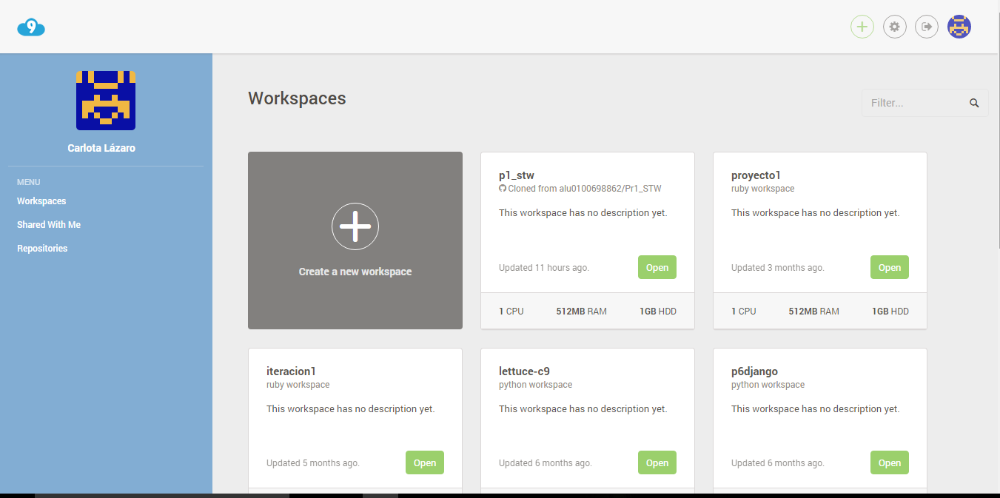
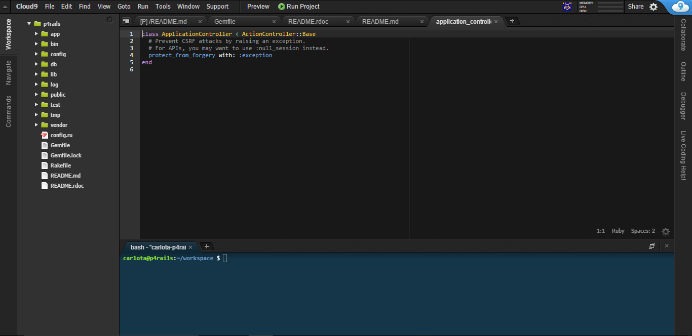
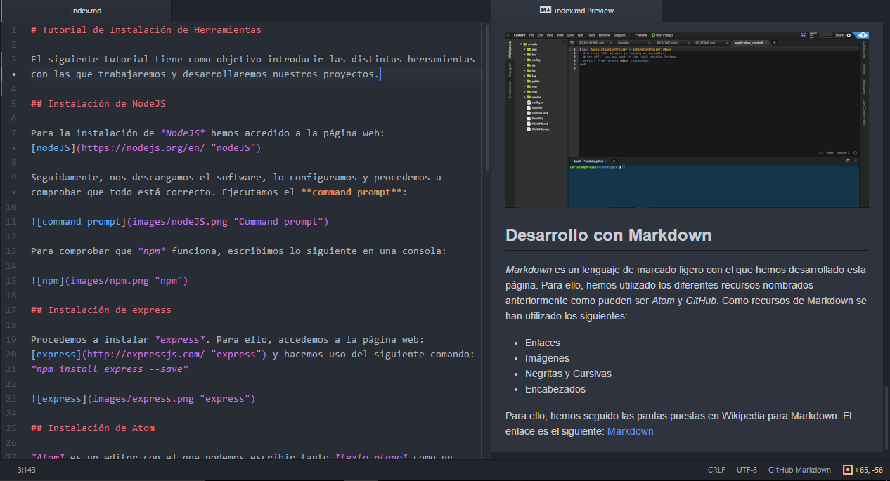

# Tutorial de Instalación de Herramientas

El siguiente tutorial tiene como objetivo introducir las distintas herramientas con las que trabajaremos y desarrollaremos nuestros proyectos.

## Instalación de NodeJS

Para la instalación de *NodeJS* hemos accedido a la página web: [nodeJS](https://nodejs.org/en/ "nodeJS")

Seguidamente, nos descargamos el software, lo configuramos y procedemos a comprobar que todo está correcto. Ejecutamos el **command prompt**:

Para comprobar que *npm* funciona, escribimos lo siguiente en una consola:

## Instalación de express

Procedemos a instalar *express*. Para ello, accedemos a la página web:
[express](http://expressjs.com/ "express") y hacemos uso del siguiente comando:
*npm install express --save*

## Instalación de Atom

*Atom* es un editor con el que podemos escribir tanto *texto plano* como un *lenguaje de programación*. Para su instalación, entramos en su página web: [atom](https://atom.io/ "atom") y, descargamos el software.
Una vez descargado, procedemos a su instalación y, ejecutamos el programa que tendrá un aspecto como este:

## Instalación de GitHub Desktop

*GitHub Desktop* es un software que nos permite el uso de **GitHub** desde nuestro escritorio. Para ello, necesitamos acceder a la página web [github desktop](https://desktop.github.com/ "github"). Una vez descargado, procedemos a ejecutar el programa en el que tendremos que introducir nuestro correo electrónico y nuestra contraseña con la que ingresamos en nuestra cuenta de GitHub. El programa tendrá un aspecto como el siguiente:

## Creación de una cuenta en Cloud9

*Cloud9* es un **IDE** en la nube que nos permite desarrollar proyectos en diferentes lenguajes y Frameworks de desarrollo. Para poder usar este **IDE**, necesitamos crearnos una cuenta accediendo a la página web de [Cloud9](https://c9.io/ "Cloud9").
Una vez la hayamos creado, nos aparecerá nuestro espacio de trabajo y múltiples opciones como pueden ser:
- Menú
- Espacios de trabajo
- Repositorios

Siendo la visualización la siguiente:

Y, la interfaz para el desarrollo de un proyecto la siguiente:

## Desarrollo con Markdown

*Markdown* es un lenguaje de marcado ligero con el que hemos desarrollado esta página. Para ello, hemos utilizado los diferentes recursos nombrados anteriormente como pueden ser *Atom* y *GitHub*. Como recursos de Markdown se han utilizado los siguientes:

- Enlaces  
- Imágenes
- Negritas y Cursivas
- Encabezados

Para ello, hemos seguido las pautas puestas en Wikipedia para Markdown. El enlace es el siguiente: [Markdown](https://es.wikipedia.org/wiki/Markdown "Markdown")

Tutorial desarrollador por *Carlota Lázaro Hernández*
